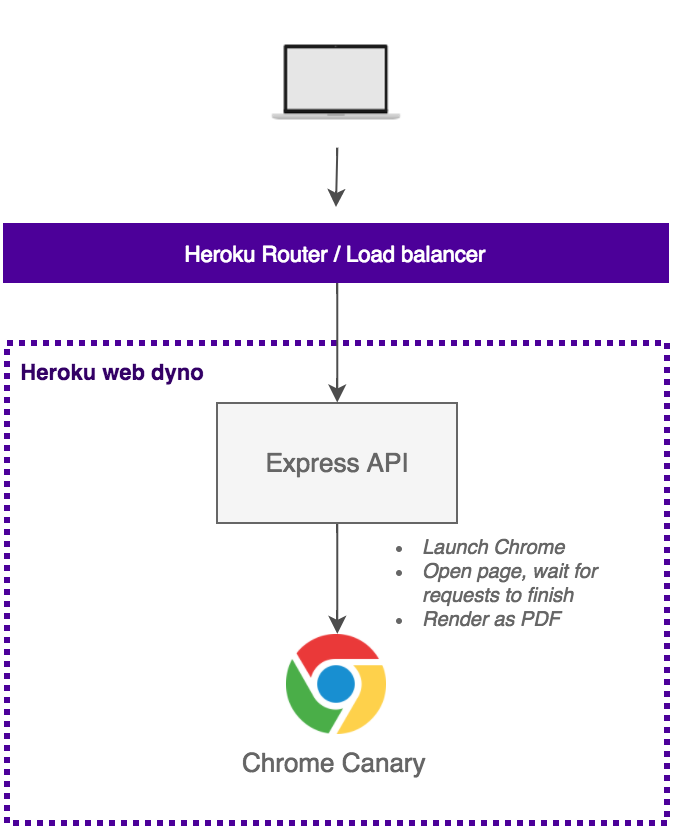

[](https://heroku.com/deploy?template=https://github.com/kimmobrunfeldt/url-to-pdf-api)

# URL to PDF

> Web page PDF rendering done right. Packaged to an easy API.

A simple API which converts a given URL to a PDF. **Why is it "done right"?**

* Rendered with Headless Chrome, using [Puppeteer](https://github.com/GoogleChrome/puppeteer)
* Sensible defaults but everything is configurable
* Easy deployment to Heroku. I love Lambda but.. Deploy to Heroku button.

Usage is as simple as https://url-to-pdf-api.herokuapp.com/api/render?url=http://google.com. There's also a POST /api/render if you prefer to send options in the body.

**Shortcuts:**

* [API](#api)
* [I want to run this myself](#development)

## How it works



Local setup is identical except Express API is running on your machine
and requests are direct connections to it.

### Good to know

* By default, we set Chrome to emulate `screen` media. To change this behaviour, try adding `&emulateScreenMedia=true`. See more at [Puppeteer API docs](https://github.com/GoogleChrome/puppeteer/blob/master/docs/api.md#pagepdfoptions).

* Chrome is launched with `--no-sandbox --disable-setuid-sandbox` flags to fix usage in Heroku. See [this issue](https://github.com/GoogleChrome/puppeteer/issues/290).


## API

To understand the API options, you need to know how Puppeteer is internally used.
This is the execution flow:

1. **`page.setViewport(options)`** where options matches `viewport.*`.
2. *Possibly* **`page.emulateMedia('screen')`** if `emulateScreenMedia=true` is set.
3. *Possibly* **`page.waitFor(numOrStr)`** if e.g. `waitFor=1000` is set.
4. **`page.goto(url, options)`** where options matches `goto.*`.
5. *Possibly* **Scroll the whole page** to the end before rendering if e.g. `scrollPage=true` is set.

    This is useful if you want to render a page which lazy loads elements.

6. **`page.pdf(options)`** where options matches `pdf.*`.

This HTTP API exposes exactly the same options as Puppeteer provides, so you can always
refer to their docs: https://github.com/GoogleChrome/puppeteer/blob/master/docs/api.md.


### POST /api/render

All options are passed in a JSON body object. Find all parameters in [src/util/validation.js](src/util/validation.js) in `renderBodyParams` object. Parameter names match Puppeteer options.

**Body**

The only required parameter is `url`.

```js
{
  // Url to render
  url: "https://google.com",

  // If we should emulate @media screen instead of print
  emulateScreenMedia: true,

  // If true, page is scrolled to the end before rendering
  scrollPage: false,

  // Passed to Puppeteer page.waitFor()
  waitFor: null,

  // Passed to Puppeteer page.setViewport()
  viewport: { ... },

  // Passed to Puppeteer page.goto() as the second argument after url
  goto: { ... },

  // Passed to Puppeteer page.pdf()
  pdf: { ... }
}
```

**Example:**

```bash
curl -o google.pdf -XPOST -d'{"url": "http://google.com"}' -H"content-type: application/json" https://url-to-pdf-api.herokuapp.com/api/render
```

### GET /api/render

All options are passed as query parameters. Find all parameters in [src/util/validation.js](src/util/validation.js) in `renderQueryParams` object. Parameter names match Puppeteer options.

These options are exactly the same as its `POST` counterpart, but options in an
object tree are expressed with the dot notation. E.g. `?pdf.margin.top=10px`.

The only required parameter is `url`.

**Example:**

```bash
curl -o google.pdf https://url-to-pdf-api.herokuapp.com/api/render?url=http://google.com
```


## Development

To get this thing running, you have two options: run it in Heroku, or locally.

**Remember, the code requires Node 8+ (async, await).**

#### 1. Heroku deployment

Scroll this readme up to the Deploy to Heroku -button. Click it and follow
instructions.

#### 2. Local development

First, clone the repository and cd into it.

* `cp .env.sample .env`
* Fill in the blanks in `.env`
* `source .env` or `bash .env`

  Or use [autoenv](https://github.com/kennethreitz/autoenv).

* `npm install`
* `npm start` Start express server locally
* Server runs at http://localhost:9000 or what `$PORT` env defines


### Techstack

* Node 8+ (async, await), written in ES7
* [Express.js](https://expressjs.com/) app with a nice internal architecture, based on [these conventions](https://github.com/kimmobrunfeldt/express-example).
* Hapi-style Joi validation with [express-validation](https://github.com/andrewkeig/express-validation)
* Heroku + [Puppeteer buildpack](https://github.com/jontewks/puppeteer-heroku-buildpack)
* [Puppeteer](https://github.com/GoogleChrome/puppeteer) to control Chrome
